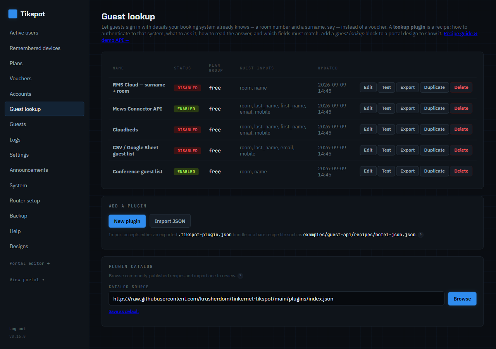
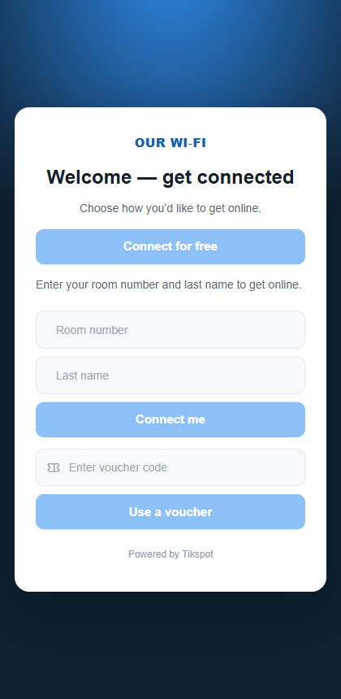
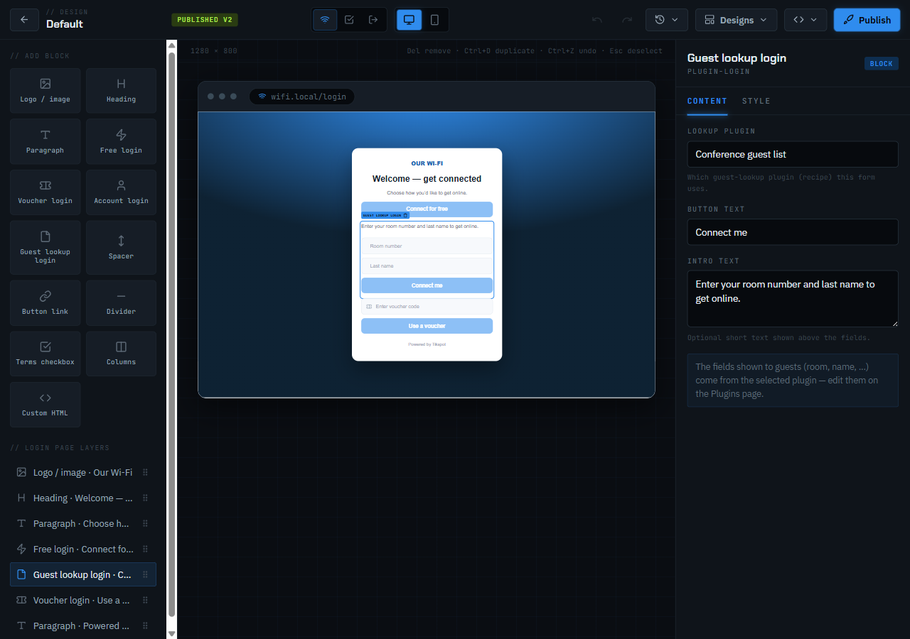
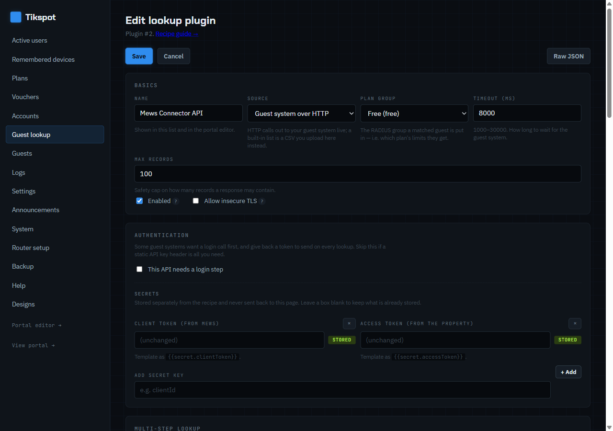
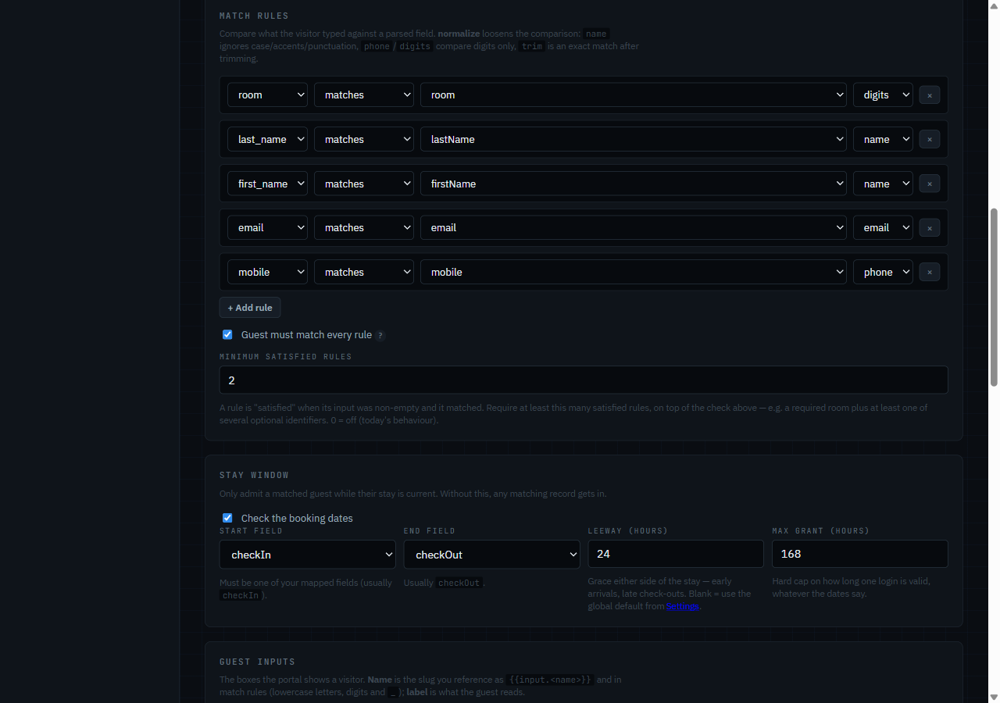
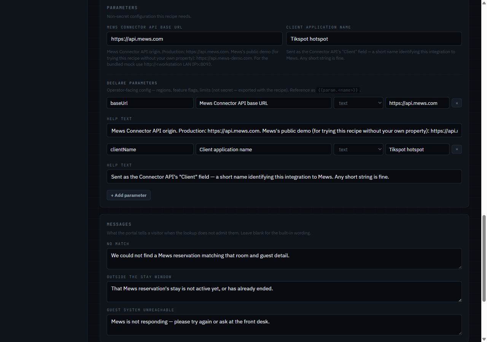
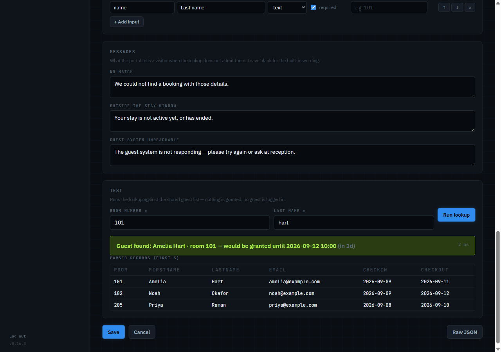
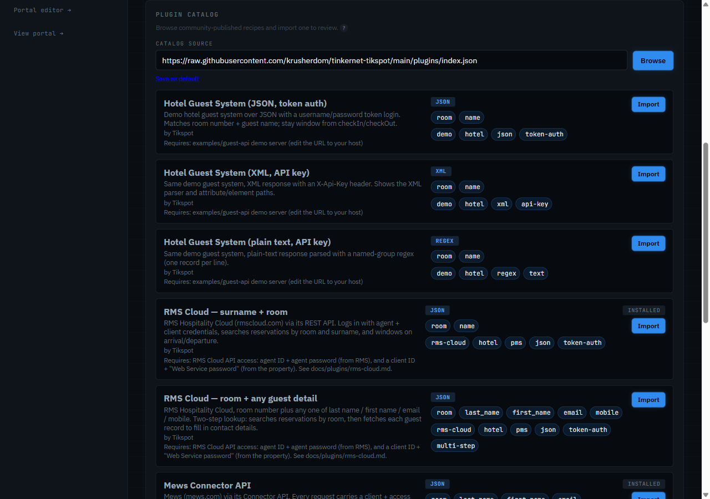

# Guest-lookup plugins

A **lookup plugin** lets guests log in with details your own system already knows —
room number and surname, a booking reference, a mobile number, an email — instead of a
voucher or account. Tikspot queries your system (a hotel PMS, a club membership API, a
spreadsheet behind a small web service…), checks the guest exists and that their stay is
current, and admits them onto a plan for the rest of the stay.

Nothing about the external system is hard-coded: a plugin is a **recipe** you author in
the admin (Guest lookup tab) describing how to call the API, how to parse the answer, which
fields identify a guest and which dates bound the stay. For the full field-by-field
reference (including multi-step lookups, structured JSON bodies, pagination, and other
advanced features), see [`docs/plugins/README.md`](plugins/README.md).

Don't have an API at all? A CSV — a Google Sheet, or one pasted straight into the admin —
works too; see [`docs/plugins/csv-and-guest-list.md`](plugins/csv-and-guest-list.md).

## What it looks like

The admin's **Guest lookup** tab lists your plugins and the catalog browser:



Guests see the plugin's inputs as a form on the portal page (add a *Guest lookup login* block
in the portal editor):

<p align="center"></p>

## Ready-made recipes

The catalog ships recipes for these systems already — install one from **Guest lookup →
Browse catalog** rather than building from scratch. `Verified` says whether it's been run
against the real vendor's API (`live`) or built from their docs and tested only against a
bundled mock (`mock` — still a strong starting point, just verify with **Test lookup**
first). Full list, plus systems that are documented but not yet shipped as a recipe:
[`docs/plugins/README.md`](plugins/README.md#supported-systems).

| System | Verified | Docs |
|---|---|---|
| RMS Cloud | mock | [`plugins/rms-cloud.md`](plugins/rms-cloud.md) |
| Mews | live | [`plugins/mews.md`](plugins/mews.md) |
| Apaleo | mock | [`plugins/apaleo.md`](plugins/apaleo.md) |
| Cloudbeds | mock | [`plugins/cloudbeds.md`](plugins/cloudbeds.md) |
| Eventbrite | mock | [`plugins/eventbrite.md`](plugins/eventbrite.md) |
| CSV / Google Sheet, or built-in guest list | mock | [`plugins/csv-and-guest-list.md`](plugins/csv-and-guest-list.md) |

## Adding the block to a design

In the portal editor, add a **Guest lookup login** block and pick the plugin. The form fields
come from the plugin's *Guest inputs*; the block only owns the intro text and button label.



## How a login flows

1. The page designer's **Guest lookup** block shows the recipe's input fields (e.g. *Room
   number*, *Last name*).
2. The guest submits; the form posts to the **container** (`/portal/lookup/<id>`), not the
   router. The container is inside the walled garden, so the guest can reach it.
3. The container calls your API (optionally logging in first to get a token), parses the
   response as **JSON, XML or plain text via regex**, matches the guest, and checks the
   stay window with a leeway (24 h by default, per-recipe or global in Settings).
4. On success it mints a temporary RADIUS credential (`pg-xxxxxx`) in the recipe's plan
   group, valid until check-out + leeway (capped by *max grant hours*), and returns a
   "Connecting…" page that submits that credential to the router's login URL. The plan's
   speed/data/time limits and MAC-remember apply exactly as for any other login.
5. The credential is removed automatically when it expires; you can see and revoke active
   guests under **Guests**.

Failures show the recipe's own messages on the login page and are recorded as events
(field *names* only — never the values a guest typed, tokens or secrets).

## Recipe anatomy

| Section | What it describes |
|---|---|
| Basics | name, enabled, plan, timeout, insecure-TLS allowance, max records |
| Authentication (optional) | a login request that returns a token (JSON path), its TTL, and where to place it on later requests (header / query / body) |
| Request | method, URL, headers and body template — with `{{input.room}}`, `{{token}}`, `{{secret.apiKey}}` placeholders |
| Parser | `json` (dot/bracket paths, `[*]`), `xml` (same paths, attributes as `@name`), or `regex` (one record per match, named groups); a date format |
| Field map | which path/group holds `firstName`, `lastName`, `room`, `mobile`, `email`, `checkIn`, `checkOut`, `bookingRef` (custom fields allowed) |
| Match rules | which input must equal which field (or *any of* several), with normalisation: `name` (case/diacritic-insensitive), `phone` (digits, last 9 compared), `email`, `trim`, `digits`, `upper` |
| Stay window (optional) | start/end fields, leeway hours, max grant hours. No window = grant *max grant hours* from now |
| Guest inputs | the fields the login page shows: name, label, type, required, placeholder |
| Messages | what the guest sees on no-match / outside-window / API failure |
| Secrets | username, password, API key — write-only; redacted from exports and backups |

The **Raw JSON** toggle shows the same recipe as JSON for copy/paste and sharing;
**Export** / **Import** move recipes between installs (secrets excluded).

## Editing a recipe in the admin

The guided form covers everything a recipe can express. Secrets are stored separately and
never shown again; parameters (regions, property IDs) are plain config exported with the
recipe.







## Testing a recipe




Use **Test lookup** in the plugin editor: enter sample inputs and see the outcome, the
parsed records, the raw response excerpt and timing. Test before adding the block to the
page. Remember the container needs **outbound access** to your API — a masquerade rule for
the container subnet on the router (Verify flags a missing one) and a reachable URL. The
System tab's *egress check* can confirm this.

## Browsing the catalog




**Guest lookup → Browse catalog** lists recipes published in the repo's
[`plugins/`](../plugins/) folder (or wherever *Settings → Plugin catalog URL* points: an
`index.json`, a GitHub folder URL like `https://github.com/you/repo/tree/main/plugins`,
or a single exported file). **Import** creates the plugin *disabled* with empty secrets;
open it, set the real host and credentials, run **Test lookup**, then enable it. The
container fetches the catalog itself, so it needs outbound internet (the masquerade rule
Verify checks) and DNS. To share a recipe, export it and follow `plugins/README.md`.

## Trying it without a real guest system

`examples/guest-api/` is a zero-dependency demo API with sample guests and three ready
recipes (JSON with token auth, XML with an API key, plain text with regex):

```sh
npm run guest-api           # from the repo root, on your workstation
```

Then import `examples/guest-api/recipes/hotel-json.json` in **Guest lookup**, change the
URL to your workstation's LAN IP (the router's container cannot reach `127.0.0.1`), test
with room `101` and the matching surname from `guests.json`, add a *Guest lookup* block to
the page and publish. See `examples/guest-api/README.md` for details and how to edit the
sample data.

There's a second mock, `examples/rms-mock/`, shaped like the real RMS Cloud API (`npm run
rms-mock`) — used to develop and test the two RMS Cloud catalog recipes; see
[`docs/plugins/rms-cloud.md`](plugins/rms-cloud.md).

Each 0.16 recipe has its own bundled mock, too: `examples/mews-mock/` (`npm run
mews-mock`), `examples/apaleo-mock/` (`npm run apaleo-mock`), `examples/cloudbeds-mock/`
(`npm run cloudbeds-mock`), `examples/eventbrite-mock/` (`npm run eventbrite-mock`), and
`examples/csv-guest-list/` (`npm run csv-guest-list`, a static file server for
`guests.csv`). See each system's doc page (linked in the table above) for sample
credentials and inputs to try.
